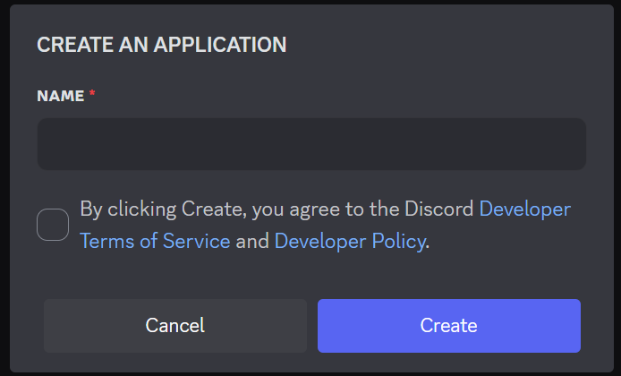
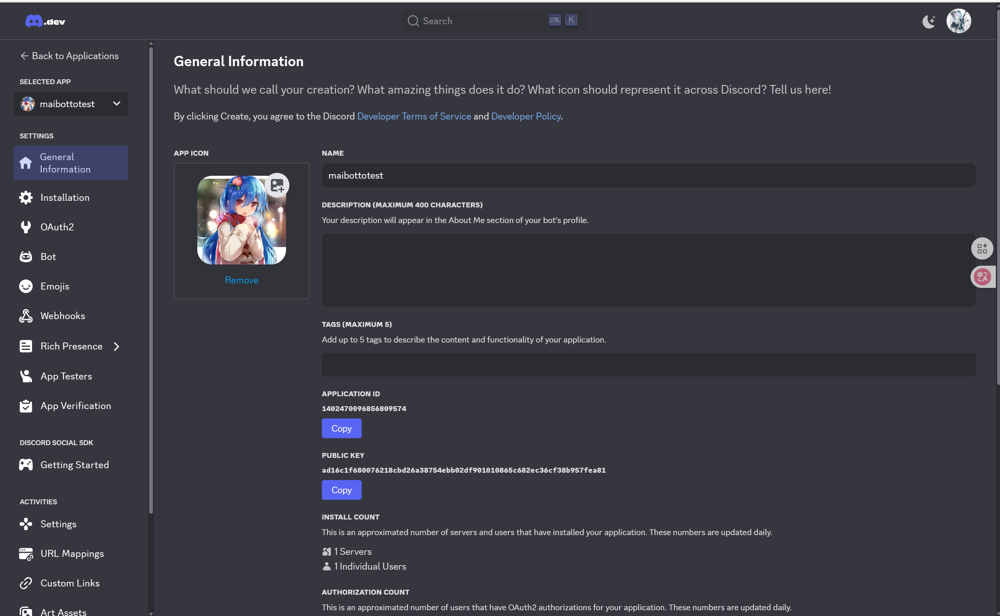
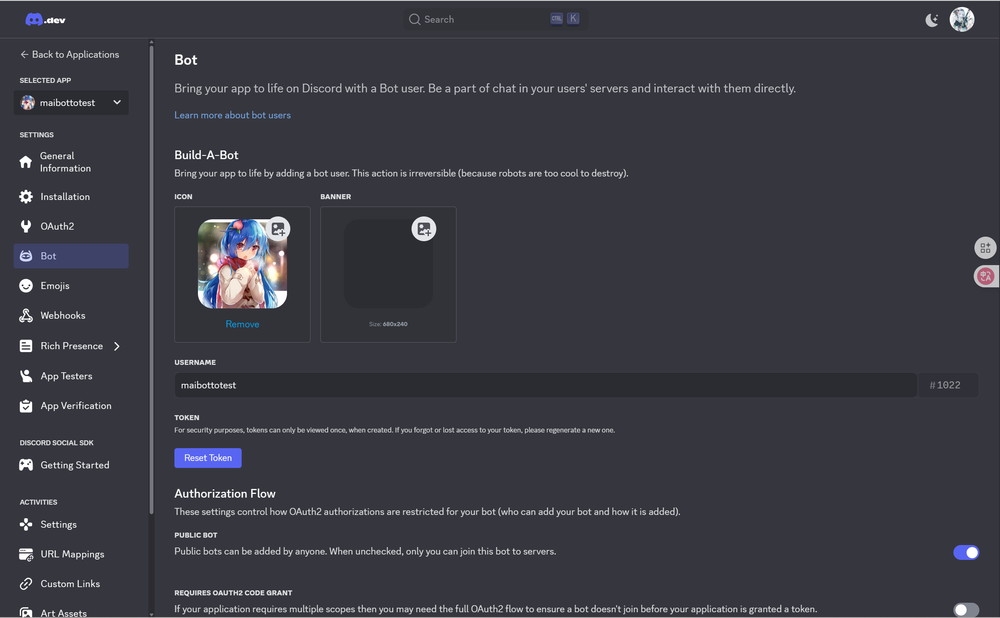
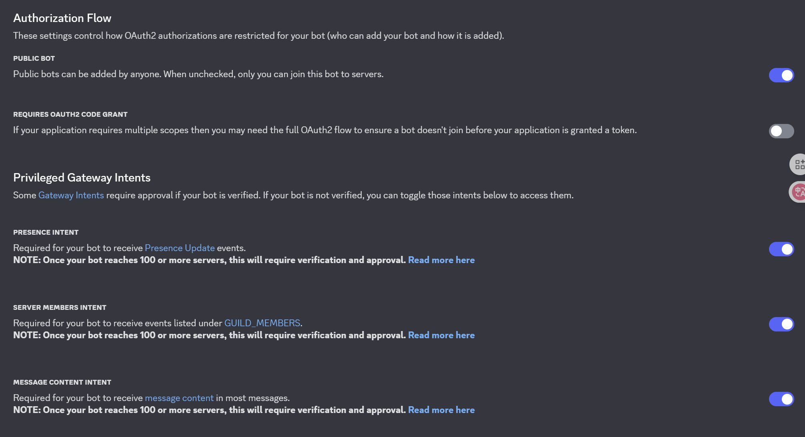
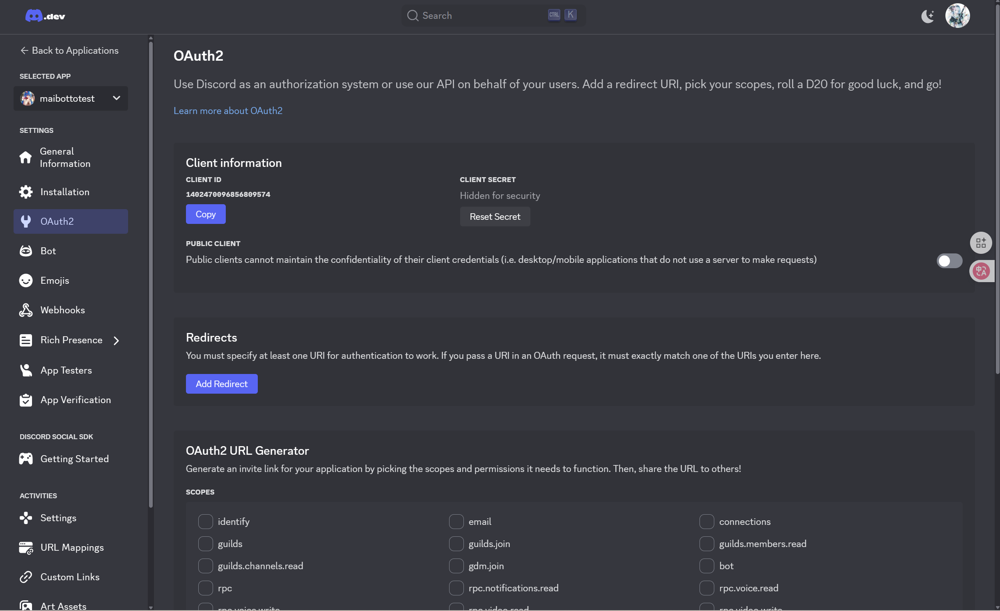
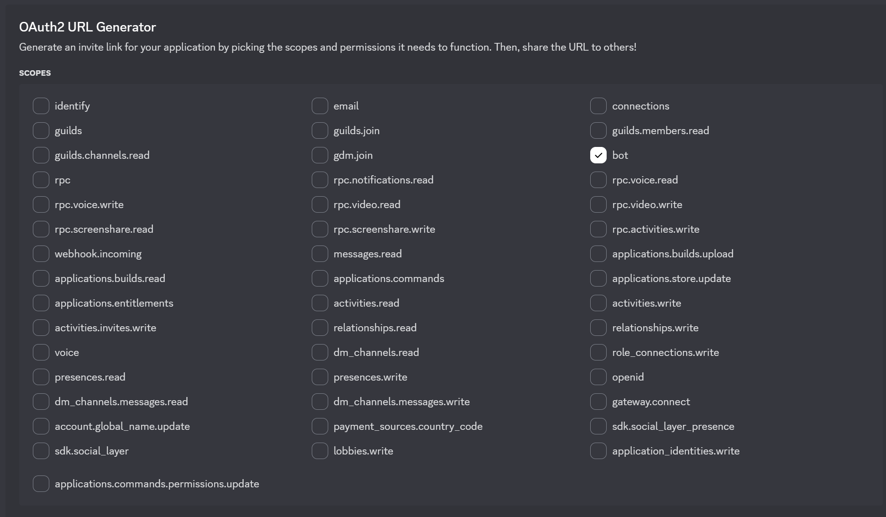
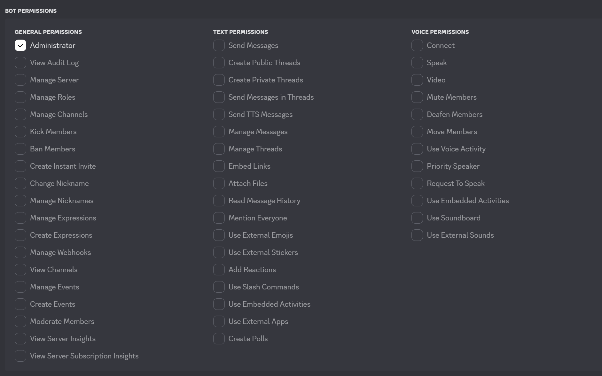
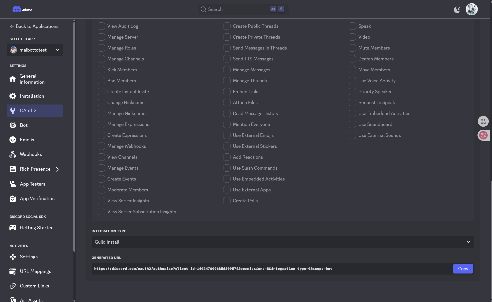
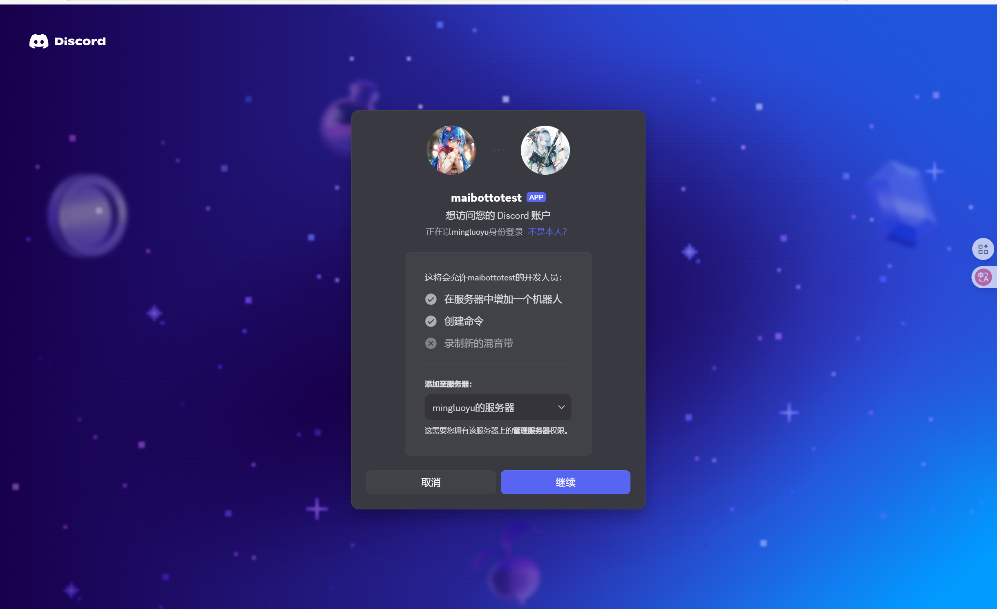

# MaiBot 与 Discord 的 Adapter

运行方式：独立/放在MaiBot本体作为插件
<div align="center">
[](https://discord.gg/ue4xJw7s)
</div>
## 使用说明

### 一、获取必要的文件

1. 通过 git clone 将 [MaiBot-Discord-Adapter](https://github.com/2829798842/MaiBot-Discord-Adapter) clone 到本地

```
git clone https://github.com/2829798842/MaiBot-Discord-Adapter.git
cd MaiBot-Discord-Adapter
```

### 二、环境配置

#### 安装 uv (推荐)

首先安装 uv 包管理器，可以通过以下命令快速安装：

```
# 使用 pip 安装 uv
pip install uv
```

#### 虚拟环境版 (传统方式)

1. 首先，在[官网](https://www.python.org/)下载python，并安装**大于等于3.10的版本**并添加系统变量。
2. 随后在 `MaiM-with-u` 文件夹创建Python虚拟环境并激活

```
python -m venv MaiBot\venv
.\MaiBot\venv\Scripts\activate
```

### 三、依赖安装

#### 使用 uv 安装依赖 (推荐)

1. 进入下载的discord_adapter文件夹，创建虚拟环境并安装依赖

```
uv venv
uv pip install -r requirements.txt -i https://mirrors.aliyun.com/pypi/simple --upgrade
```

#### 使用 pip 安装依赖 (传统方式)

1. 进入下载的discord_adapter文件夹
2. pip安装所需依赖

```
cd MaiBot-Discord-Adapter
pip install -i https://mirrors.aliyun.com/pypi/simple -r .\requirements.txt --upgrade
```

### 四、创建discord_bot

登录[Discord for Developers](https://discord.com/developers)

在点击进入**开始**后界面跳转到[My Applications | Discord Developer Portal](https://discord.com/developers/applications)后，点击**New Application**

此时会询问你关于你的bot的名字，这里获取的名字和麦麦的名字是独立的，因此可以任意命名

成功进入后是这个样子(此时头像图片可以自己上传选择)

找到侧边栏Bot选项

这里的token即为你的discord_bot的令牌，请**务必保存**好，他只会显示一次，如果意外丢失请点击**reset**



由于public_bot转变为privacy_bot需要申请等，我们无需理会

```
Presence Intent
Required for your bot to receive Presence Update events.
```

用于获取你的bot的状态等

```
Server Members Intent
Required for your bot to receive events listed under GUILD_MEMBERS.
```

用于接受一些加入频道消息等

```
Message Content Intent
Required for your bot to receive message content in most messages.
```

这一条是能让你的discord_bot能够接受并读取消息，请**务必勾选**

### 五、让你的discord_bot加入你的服务器

由于discord单个服务器有多个频道，所以如果你想限制你的discord_bot在不同频道发言请自行配置黑白名单，此时频道相当于你的群聊

进入侧边栏的oauth2栏

此时开始进行邀请你的discord_bot进入你的服务器



请**务必勾选bot**选项



这里是你的discord_bot的权限选择，你可以图省事直接勾选adminstrater选项(其余权限选择需逐个选择)



这是你的界面下方有已生成的URL,即:GENRRATED URL

将其复制到你的浏览器或者discord邀请链接中，例如这是我直接在浏览器打开

继续即可

### 六、discord_adapter 配置修改

打开你的文件夹找到`template`下的`template_config.toml`复制到Adapter的根目录，改名为`config.toml`

```
[inner]
version = "1.0.0" # 版本号
# 请勿修改版本号，除非你知道自己在做什么

[discord] # Discord Bot 设置
token = "your_discord_bot_token_"

# Discord 权限意图设置
[discord.intents]
messages = true
guilds = true
dm_messages = true
message_content = true

[chat]
# 获取服务器 ID：右键点击服务器名称 -> 复制服务器 ID
# 获取频道 ID：右键点击频道名称 -> 复制频道 ID
# 获取用户 ID：右键点击用户头像 -> 复制用户 ID
# 注意：需要开启 Discord 开发者模式（用户设置 -> 高级 -> 开发者模式）

guild_list_type = "blacklist" # 服务器名单类型，可选为：whitelist, blacklist
guild_list = []               # 服务器名单
# 当 guild_list_type 为 whitelist 时，只有服务器名单中的服务器可以使用 Bot
# 当 guild_list_type 为 blacklist 时，服务器名单中的任何服务器无法使用 Bot
channel_list_type = "blacklist" # 频道名单类型，可选为：whitelist, blacklist
channel_list = []               # 频道名单
# 当 channel_list_type 为 whitelist 时，只有频道名单中的频道可以使用 Bot
# 当 channel_list_type 为 blacklist 时，频道名单中的任何频道无法使用 Bot
user_list_type = "blacklist"  # 用户名单类型，可选为：whitelist, blacklist
user_list = []                # 用户名单
# 当 user_list_type 为 whitelist 时，只有用户名单中的用户可以使用 Bot
# 当 user_list_type 为 blacklist 时，用户名单中的任何用户无法使用 Bot

[maibot_server] # 连接 MaiBot Core 的服务设置
host = "127.0.0.1" # MaiBot Core 主机地址
port = 8000        # MaiBot Core 端口
platform_name = "discord_bot_instance_1" # 平台标识符，目前仅作为标记使用，不同实例请勿重复

[debug]
level = "INFO" # 日志等级（DEBUG, INFO, WARNING, ERROR, CRITICAL）
log_file = "logs/discord_adapter.log" # 日志文件路径
```

由于discord官方支持bot部署，所以你只需要提供你的discord_bot_token即可

此时因为全部都是黑名单模式，所以你的discord_bot所在的服务器频道皆可发言

### 七、运行

#### 使用 uv 运行 (推荐)

```
uv run python main.py
```

### 传统方式运行

```
python .\main.py
```


#### 当前功能状态

- [x] Discord消息接收
  - [x] 文本消息处理
  - [x] 图片消息处理
  - [x] emoji消息识别
  - [x] 贴纸消息处理
  - [x] 引用回复支持
- [x] 配置与权限
  - [x] Discord权限意图配置
  - [x] 黑白名单支持 (用户/频道/服务器)

由于本人技术有限，大多功能尚未实现，请提issue💦💦💦

### 目前已知bug

1.**严重？** 在未知情况下会出现启动适配器后无法连接discord的情况
具体表现为在discord还能正常连接的情况下，仍会连接失败
目前建议您在使用时打开Tun模式

2.由于discord的emoji的格式问题，麦麦接受到消息后会认为这是一段文字而非一个emoji，因此建议配合使用discord_emoji_enhance_plugin使用

3.关于头像发送时机未知，已知仅此discord_bot自身头像

## 特别鸣谢

特别感谢[@UnCLAS-Prommer]([UnCLAS-Prommer](https://github.com/UnCLAS-Prommer))老师napcat-adapter的代码进行借鉴
