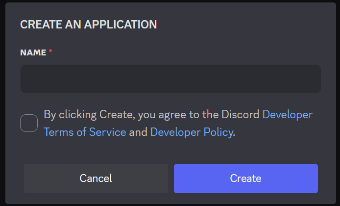
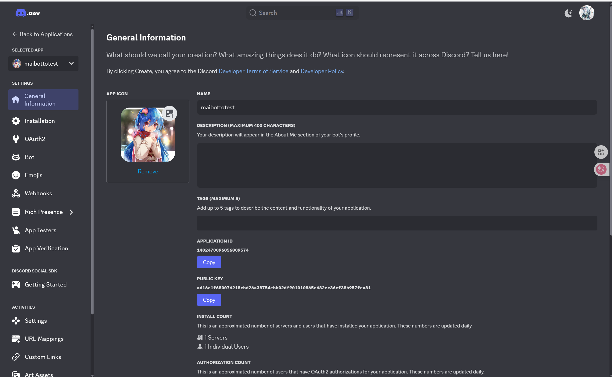
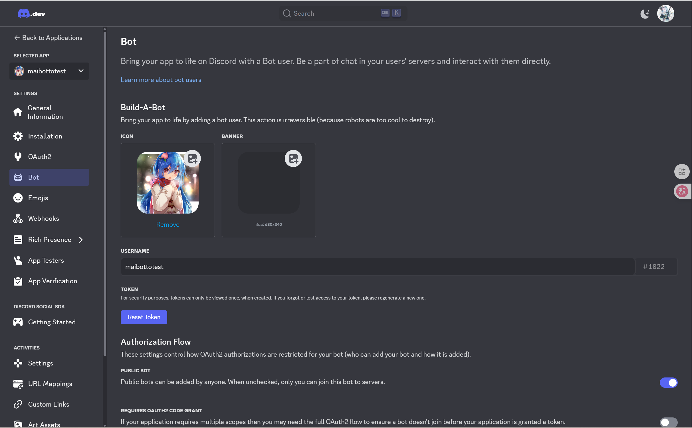
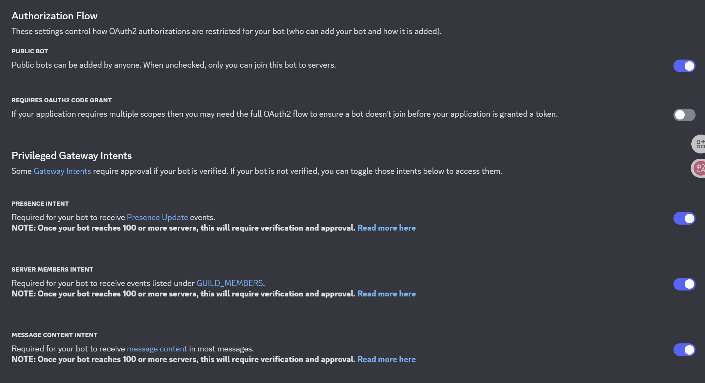
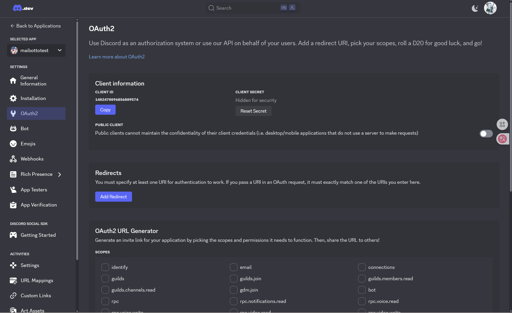
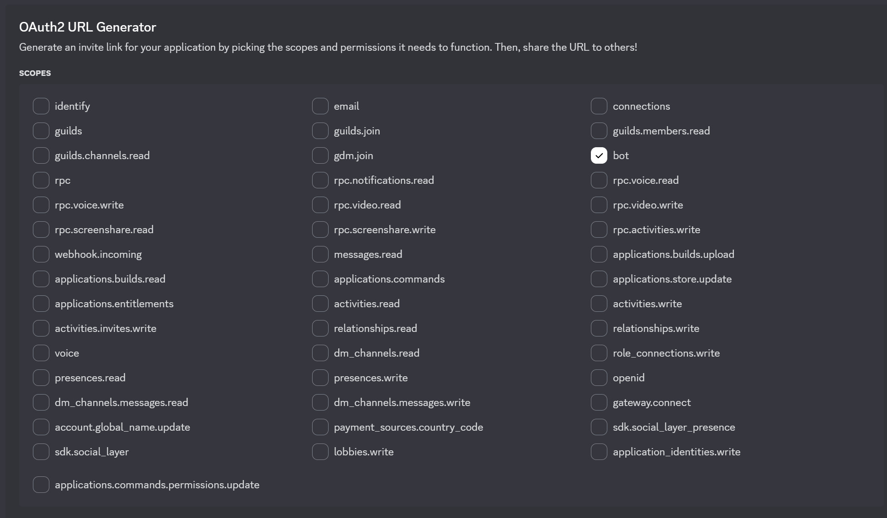
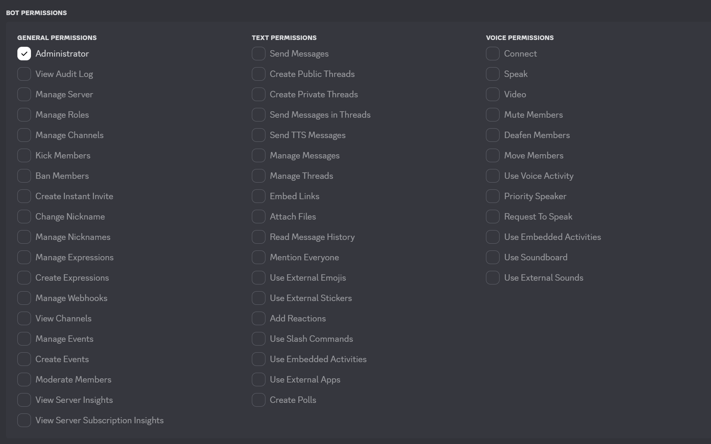
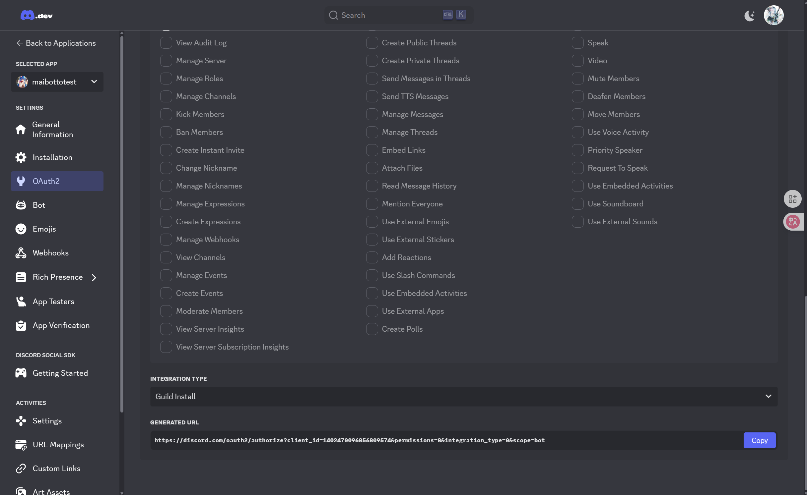
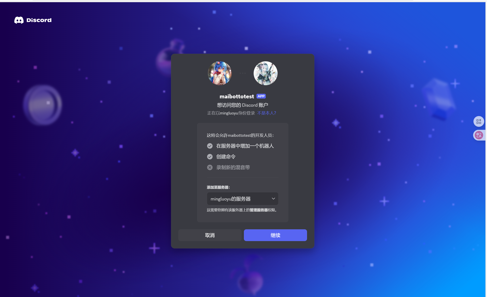

# MaiBot Discord Adapter 安装与配置指南

这份文档以当前 `maibot-discord-adapter` 的实际实现为准，面向 MaiBot 新插件体系。

适配器本身是一个基于 MaiBot Plugin SDK 2.x 的 `MessageGateway` 平台接入插件，不再使用旧版 `BasePlugin` / `register_plugin` / `maibot_server` 直连配置方式。

## 1. 适用范围

当前文档对应的是：

- 插件目录：`MaiBot/plugins/maibot-discord-adapter`
- 配置模型：[`config.py`](../config.py)
- 插件入口：[`plugin.py`](../plugin.py)

如果你看到别的旧文档里还在写这些内容，请以本文件和 `config.py` 为准：

- `[maibot_server]`
- `discord.intents.messages`
- Azure / AI Hobbyist 语音配置
- 仅支持环境变量注入 Token

这些都不是当前实现的主路径了。

## 2. 安装前提

使用这个适配器前，请先确认：

- MaiBot 主程序已经可以正常启动
- 插件目录已经放在 `MaiBot/plugins/maibot-discord-adapter`
- 运行环境已安装本插件依赖
- Discord Bot 已在 Developer Portal 创建完成

当前插件元数据声明的核心 Python 依赖包括：

- `discord.py >= 2.3.0`
- `discord-ext-voice-recv >= 0.4.1a139`
- `PyNaCl >= 1.5.0`

如果你启用语音功能，还需要本机可用的 `ffmpeg`。

## 3. 创建 Discord Bot

### 3.1 创建应用

1. 打开 <https://discord.com/developers/applications>
2. 点击 `New Application`
3. 输入应用名称并创建



### 3.2 创建 Bot 并获取 Token

1. 在应用页面进入 `Bot`
2. 创建 Bot 用户
3. 复制 Bot Token

应用基础信息页示意：



Bot 配置入口示意：



Token 获取位置示意：



当前适配器的 Token 主入口是插件配置里的：

```toml
[connection]
token = "YOUR_DISCORD_BOT_TOKEN"
```

不是旧版文档里的环境变量唯一入口，也不是旧版 `[discord] token = ...` 结构。

### 3.3 打开必要 Intents

至少建议检查这些权限项：

- `MESSAGE CONTENT INTENT`
- `SERVER MEMBERS INTENT`
- `PRESENCE INTENT`

其中最关键的是 `MESSAGE CONTENT INTENT`。如果不开，Bot 往往能收到事件但拿不到消息正文。

插件内部对应的配置字段是：

```toml
[connection]
intent_messages = true
intent_guilds = true
intent_dm_messages = true
intent_message_content = true
intent_voice_states = true
```

这里的语义是：

- `intent_messages`：Guild 消息事件
- `intent_guilds`：Guild 基本信息
- `intent_dm_messages`：DM 消息事件
- `intent_message_content`：消息正文读取
- `intent_voice_states`：语音状态事件；如果你要用语音频道自动进出或 STT，就必须开启

## 4. 邀请 Bot 进入服务器

OAuth2 页面示意：



勾选 `bot` scope 示例：



在 Discord Developer Portal 中：

1. 打开 `OAuth2` -> `URL Generator`
2. 勾选 `bot`
3. 选择需要的权限

建议至少确保 Bot 具备这些能力：

- 查看频道
- 发送消息
- 读取消息历史
- 添加表情回应
- 附加文件
- 嵌入链接
- 连接语音频道
- 讲话

权限勾选示意：



如果你要使用线程、回复、Reaction、语音等功能，权限最好一次配齐，否则排障会比较绕。

生成邀请链接示意：



最终邀请界面示意：



## 5. 插件配置结构

当前插件配置由 `config.py` 中的 `DiscordPluginSettings` 定义，主要分为以下几块。

### 5.1 `plugin`

插件基础开关和配置版本：

```toml
[plugin]
enabled = true
config_version = "0.2.0"
```

### 5.2 `connection`

Discord 连接与 intents：

```toml
[connection]
token = "YOUR_DISCORD_BOT_TOKEN"
intent_messages = true
intent_guilds = true
intent_dm_messages = true
intent_message_content = true
intent_voice_states = true
retry_delay = 5
connection_check_interval = 30
```

字段说明：

- `token`：Discord Bot Token
- `retry_delay`：断线重连间隔，单位秒
- `connection_check_interval`：连接健康检查间隔，单位秒

### 5.3 `chat`

控制 guild / channel / thread / user 四层过滤与线程行为：

```toml
[chat]
guild_list_type = "blacklist"
guild_list = []
channel_list_type = "blacklist"
channel_list = []
thread_list_type = "blacklist"
thread_list = []
user_list_type = "blacklist"
user_list = []
allow_thread_interaction = true
inherit_channel_permissions = true
inherit_channel_memory = true
```

字段说明：

- `guild_list_type` / `channel_list_type` / `thread_list_type` / `user_list_type`
  - 可选值：`whitelist` 或 `blacklist`
- 对应的 `*_list`
  - 填 Discord 的真实 ID 字符串
- `allow_thread_interaction`
  - 是否处理线程消息
- `inherit_channel_permissions`
  - 线程是否沿用父频道的过滤判定
- `inherit_channel_memory`
  - 线程上下文是否回落到父频道会话

### 5.4 `platform`

```toml
[platform]
platform_name = "discord"
```

一般保持默认即可。除非你明确知道自己在做多平台实例区分，否则不要随便改。

### 5.5 `filters`

```toml
[filters]
ignore_self_message = true
ignore_bot_message = true
```

字段说明：

- `ignore_self_message`
  - 忽略 Bot 自己发出的消息，避免回环
- `ignore_bot_message`
  - 忽略其他 Bot 的消息，减少噪音

### 5.6 `voice`

```toml
[voice]
enabled = false
voice_mode = "auto"
fixed_channel_id = ""
auto_channel_list = []
idle_timeout_sec = 300
tts_provider = "siliconflow"
stt_provider = "siliconflow_sensevoice"
enable_vad = true
vad_threshold_db = -50
vad_deactivation_delay_ms = 500
send_text_in_voice = false
```

字段说明：

- `enabled`
  - 语音总开关；为 `false` 时插件不会创建语音管理器，也不会尝试加入语音频道
- `voice_mode`
  - `fixed`：固定语音频道
  - `auto`：在候选频道中自动进出
- `fixed_channel_id`
  - `voice_mode = "fixed"` 时使用，必须填语音频道 ID，不是频道分类 ID
- `auto_channel_list`
  - `voice_mode = "auto"` 时使用
- `send_text_in_voice`
  - 播放 TTS 时是否也在文本侧补发文字

更细的语音配置见 [voice_config_guide.md](./voice_config_guide.md)。

## 6. 最小可运行配置示例

如果你暂时只想让 Bot 先跑起来，可以先用这套最小配置：

```toml
[plugin]
enabled = true
config_version = "0.2.0"

[connection]
token = "YOUR_DISCORD_BOT_TOKEN"
intent_messages = true
intent_guilds = true
intent_dm_messages = true
intent_message_content = true
intent_voice_states = true
retry_delay = 5
connection_check_interval = 30

[chat]
guild_list_type = "blacklist"
guild_list = []
channel_list_type = "blacklist"
channel_list = []
thread_list_type = "blacklist"
thread_list = []
user_list_type = "blacklist"
user_list = []
allow_thread_interaction = true
inherit_channel_permissions = true
inherit_channel_memory = true

[platform]
platform_name = "discord"

[filters]
ignore_self_message = true
ignore_bot_message = true

[voice]
enabled = false
voice_mode = "auto"
fixed_channel_id = ""
auto_channel_list = []
idle_timeout_sec = 300
tts_provider = "siliconflow"
stt_provider = "siliconflow_sensevoice"
enable_vad = true
vad_threshold_db = -50
vad_deactivation_delay_ms = 500
send_text_in_voice = false
```

## 7. WebUI 与自动生成配置

当前插件已经接入 `PluginConfigBase + Field(...)` 配置模型，因此有两个重要结论：

- WebUI 配置页是根据 `config.py` 的 schema 生成的
- 自动生成的配置文件也以 `config.py` 的字段定义为准

所以如果你在 WebUI 中看不到某个字段，或者自动生成的配置没有某项，第一优先级应该检查：

1. `config.py` 里有没有这个字段
2. 字段是不是被写到了错误的层级
3. 字段的 `json_schema_extra` / 模型定义是否异常
4. 插件是否因为导入错误导致 schema 解析失败

如果 Host 日志里出现类似下面的错误：

```text
配置 Schema 解析失败，将回退到弱推断
插件配置解析请求失败
```

那么 WebUI 展示异常通常不是前端单独的问题，而是插件导入或 schema 生成阶段已经失败了。

## 8. 已知实现边界

当前适配器已经支持：

- Guild / DM / Thread 入站
- 文本、图片、Reply、Reaction
- 基础语音 TTS / STT
- 线程上下文路由

但下面这些点还不是完全体：

- 附件支持不完全对称
  - 当前真正稳定处理的是文本、图片、语音
  - `file` / `video` 仍然更偏占位表达
- Reply 入站会同时保留
  - 结构化 `reply`
  - 一段额外的回复摘要文本
- 还没有完整覆盖
  - 消息编辑 / 删除回流
  - Slash Commands
  - Buttons / Modals
  - 完整 Embed 映射

## 9. 常见问题

### 9.1 能连上 Discord，但收不到正文

优先检查：

- Developer Portal 中是否启用了 `MESSAGE CONTENT INTENT`
- 插件配置中 `connection.intent_message_content` 是否为 `true`
- Bot 是否有目标频道读取权限

### 9.2 WebUI 里没有 Token 输入框

优先检查：

- `config.py` 里的 `connection.token` 是否存在
- 插件是否成功加载
- Host 是否在日志中提示 schema 解析失败

### 9.3 自动生成配置没有更新

通常说明下面至少有一个问题：

- schema 解析失败
- 插件没有成功加载
- 配置模型字段定义不合法
- WebUI 读取回退到了旧磁盘内容

### 9.4 DM 发不出去

优先检查：

- `intent_dm_messages` 是否启用
- 路由信息里是否带到了真实的目标用户 ID
- Bot 是否能正常创建或获取 DM Channel

### 9.5 回复消息表现奇怪

这类问题要拆成两种看：

- 如果是“引用关系没建立成功”
  - 重点看结构化 `reply`、原消息 ID 回写、目标频道解析
- 如果是“模型理解时把回复内容说得很啰嗦”
  - 重点看回复摘要文本是否过多、是否和结构化 `reply` 重复

## 10. 排障建议

如果你正在排 Discord 适配器问题，日志里最值得关注的是这几类信息：

- 插件是否成功加载
- Discord 客户端是否 ready
- 网关是否上报 `ready=true`
- 入站消息是否成功转换为 Host MessageDict
- 出站路由是否拿到了正确的 `target_group_id` / `target_user_id`
- 发送后是否拿到了真实 Discord `message.id`

这几项一旦断一环，表现通常就是：

- WebUI 配置异常
- 无法解析目标频道
- Reply 无法正确关联
- DM 发送失败

## 11. 相关文件

- [README.md](../README.md)
- [voice_config_guide.md](./voice_config_guide.md)
- [config.py](../config.py)
- [plugin.py](../plugin.py)
