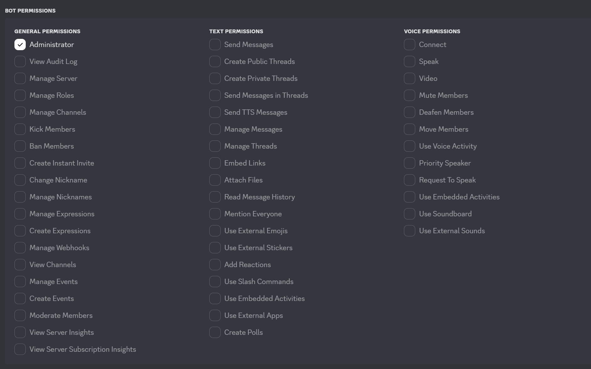

# MaiBot Discord Adapter 安装配置指南

本文档详细说明如何安装和配置 MaiBot Discord Adapter。

---

## 📋 目录

1. [环境准备](#环境准备)
2. [依赖安装](#依赖安装)
3. [创建 Discord Bot](#创建-discord-bot)
4. [Bot 邀请到服务器](#bot-邀请到服务器)
5. [配置文件设置](#配置文件设置)
6. [运行程序](#运行程序)
7. [常见问题](#常见问题)

---

## 环境准备

### 一、获取项目文件

通过 git clone 将项目克隆到本地：

```bash
git clone https://github.com/2829798842/MaiBot-Discord-Adapter.git
cd MaiBot-Discord-Adapter
```

### 二、Python 环境配置

#### 方法 1：使用 uv (推荐)

首先安装 uv 包管理器：

```bash
# 使用 pip 安装 uv
pip install uv
```

#### 方法 2：传统虚拟环境

请事先安装 **Python 3.10 或更高版本** 并添加到系统变量


```bash
python -m venv venv
.\venv\Scripts\activate  # Windows
source venv/bin/activate  # Linux/Mac
```

---

## 依赖安装

### 使用 uv 安装 (推荐)

```bash
uv venv
uv pip install -r requirements.txt -i https://mirrors.aliyun.com/pypi/simple --upgrade
```

### 使用 pip 安装 (传统方式)

```bash
pip install -i https://mirrors.aliyun.com/pypi/simple -r requirements.txt --upgrade
```

---

## 创建 Discord Bot

### 第一步：访问开发者平台

登录 [Discord Developer Portal](https://discord.com/developers)

### 第二步：创建应用

1. 点击 **New Application**
2. 输入你的 Bot 名称（可以任意命名）


### 第三步：配置 Bot

1. 进入应用后，可以上传头像等基本信息


2. 找到侧边栏的 **Bot** 选项


3. 获取 Bot Token（**务必保存好**，只显示一次）
   - 如果丢失可以点击 **Reset Token** 重新生成


### 第四步：启用必要的 Intents

在 Bot 设置页面，启用以下权限意图：

#### Presence Intent
> Required for your bot to receive Presence Update events.

用于获取 Bot 的在线状态等信息

#### Server Members Intent
> Required for your bot to receive events listed under GUILD_MEMBERS.

用于接收服务器成员相关事件

#### Message Content Intent **必须启用**
> Required for your bot to receive message content in most messages.

**这是让 Bot 能够读取消息内容的必要权限，务必勾选！**

---

## Bot 邀请到服务器

### 第一步：进入 OAuth2 设置

找到侧边栏的 **OAuth2** → **URL Generator**


### 第二步：选择权限范围

1. 在 **SCOPES** 中勾选 `bot`


2. 在 **BOT PERMISSIONS** 中选择权限



**推荐配置**：
- **简单方式**：直接勾选 `Administrator`（管理员权限）
- **精细控制**：根据需要逐个选择具体权限

### 第三步：邀请 Bot

1. 复制页面底部生成的 URL（GENERATED URL）


2. 在浏览器中打开该链接
3. 选择要添加 Bot 的服务器
4. 点击 **继续** 完成授权


---

## 配置文件设置

### 第一步：创建配置文件

1. 复制模板配置文件：
   ```bash
   # Windows
   copy template\template_config.toml config.toml
   
   # Linux/Mac
   cp template/template_config.toml config.toml
   ```

### 第二步：编辑配置文件

打开 `config.toml` 并修改以下内容：

```toml
[inner]
version = "1.0.0" # 版本号
# 请勿修改版本号，除非你知道自己在做什么

[discord] # Discord Bot 设置
token = "your_discord_bot_token_here"  # ← 填入你的 Bot Token
bot_id = "your_bot_id_here"  # ← 填入你的 Bot ID（可选，建议填写）

# Discord 权限意图设置
[discord.intents]
messages = true
guilds = true
dm_messages = true
message_content = true  # 必须为 true

[chat]
# 获取 ID 的方法：
# 1. 开启 Discord 开发者模式：用户设置 → 高级 → 开发者模式
# 2. 服务器 ID：右键点击服务器名称 → 复制服务器 ID
# 3. 频道 ID：右键点击频道名称 → 复制频道 ID
# 4. 用户 ID：右键点击用户头像 → 复制用户 ID

guild_list_type = "blacklist" # 服务器名单类型：whitelist, blacklist
guild_list = []               # 服务器 ID 列表
# whitelist：只有列表中的服务器可以使用 Bot
# blacklist：列表中的服务器无法使用 Bot

channel_list_type = "blacklist" # 频道名单类型
channel_list = []               # 频道 ID 列表

user_list_type = "blacklist"  # 用户名单类型
user_list = []                # 用户 ID 列表

[maibot_server] # 连接 MaiBot Core 的服务设置
host = "127.0.0.1" # MaiBot Core 主机地址
port = 8000        # MaiBot Core 端口
platform_name = "discord_bot_instance_1" # 平台标识符（多实例时请使用不同名称）

[debug]
level = "INFO" # 日志等级（DEBUG, INFO, WARNING, ERROR, CRITICAL）
log_file = "logs/discord_adapter.log" # 日志文件路径
```

### 黑白名单说明

默认配置为黑名单模式且列表为空，意味着：
- ✅ Bot 可以在所有服务器的所有频道响应所有用户
- ⚠️ 如需限制，请添加对应 ID 到黑名单，或改用白名单模式

### 语音功能配置（可选）

如需启用语音功能，请参考 [语音配置指南](voice_config_guide.md)

---

## 运行程序

### 使用 uv 运行 (推荐)

```bash
uv run python main.py
```

### 传统方式运行

```bash
# 确保已激活虚拟环境
python main.py
```

### 成功运行的标志

如果看到以下日志，说明启动成功：

```
INFO - Discord Adapter 已启动
INFO - 已连接到 Discord
INFO - Bot 已准备就绪
```

---

## 常见问题

### Q1: Cannot connect to host discord.com:443 ssl:default

**原因**：网络代理配置问题

**解决方案**：

**Windows 系统**：
```cmd
set http_proxy=http://127.0.0.1:7890
set https_proxy=http://127.0.0.1:7890
```
（端口改为你的代理端口）

**Linux/Mac 系统**：
```bash
export http_proxy=http://127.0.0.1:7890
export https_proxy=http://127.0.0.1:7890
```

如果仍然无法连接：
1. 尝试开启 VPN 的 TUN 模式
2. 更换更稳定的代理服务
3. 检查防火墙设置
4. 亦或者使用境外服务器

### Q2: Bot 收不到消息

**检查清单**：

1. ✅ 确认已启用 `Message Content Intent`
2. ✅ 检查 `config.toml` 中 `message_content = true`
3. ✅ 确认 Bot 已成功加入服务器
4. ✅ 检查频道权限（Bot 需要"查看频道"和"发送消息"权限）
5. ✅ 查看日志中是否有错误信息

### Q3: Bot Token 无效

**解决方法**：
1. 返回 Discord Developer Portal
2. 点击 **Reset Token** 重新生成
3. 更新 `config.toml` 中的 token

### Q4: 如何获取 Bot ID？

**方法 1**：开启开发者模式后，右键点击 Bot 头像 → 复制用户 ID

**方法 2**：在 Discord Developer Portal 的 General Information 页面查看 Application ID

### Q5: 权限不足无法发送消息

**解决方法**：
1. 检查 Bot 在服务器中的角色权限
2. 确保 Bot 有"发送消息"权限
3. 检查特定频道的权限覆盖设置

### Q6: 如何更新到最新版本？

```bash
git pull origin main  # 或 voice 分支
pip install -r requirements.txt --upgrade
```

## 

### 子区（Thread）配置

```toml
[chat]
allow_thread_interaction = true  # 是否允许子区交互
inherit_channel_permissions = true  # 子区是否继承父频道权限
inherit_channel_memory = true  # 子区是否继承父频道记忆
```

**说明**：
- `inherit_channel_memory = true`：子区与父频道共享聊天记录和上下文
- `inherit_channel_permissions = true`：子区使用父频道的权限配置

### Discord 连接重试设置

```toml
[discord.retry]
retry_delay = 5                  # 重试间隔（秒）
connection_check_interval = 30  # 连接状态检查间隔（秒）
```

---

## 获取帮助

如遇到问题：

1.  查看本文档和相关文档
2.  检查日志文件 `logs/discord_adapter.log`
3.  加入 Discord 服务器求助：[](https://discord.gg/ue4xJw7s)
4.  提交 Issue：[GitHub Issues](https://github.com/2829798842/MaiBot-Discord-Adapter/issues)

---

**祝你使用愉快！** 
